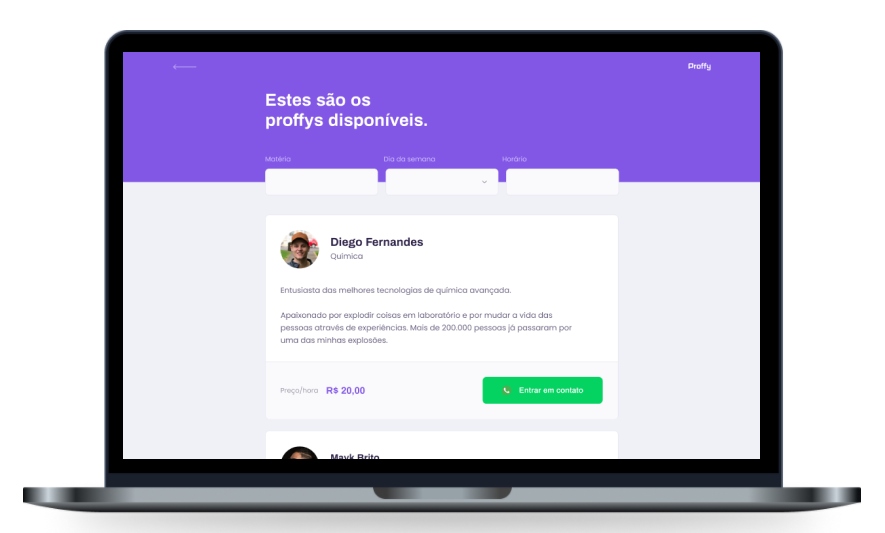

<h1 align="center">
    
</h1>

<h1 align="center">
    
</h1>

## 📝 Projeto
Proffy é uma plataforma online que conecta estudantes e professores. É possível se cadastrar para oferecer aulas ou procurar professores das matérias que você quer aprender.

Este projeto foi desenvolvido durante a NLW#2 - Next Level Week #2, trilha Discovery, oferecida pela Rocketseat.

## 💻 Tecnologias
- HTML
- CSS
- JavaScript
- Node.js
- Express
- Nunjucks
- SQLite

## 🎨 Layout
O layout da aplicação está disponível no [Figma](https://www.figma.com/file/GHGS126t7WYjnPZdRKChJF/Proffy-Web?node-id=0%3A1).

## 🔧 Executar no seu PC

- Clone esse repositório;
- Vá para o diretório do projeto `cd nextlevelweek-discovery-proffy/`;
- Execute o comando para instalar as dependências, como `npm install` ou `yarn`;
- Execute o comando para iniciar o projeto, por exemplo: `npm run dev` ou `yarn start`;
- Acesse a aplicação em <strong> `http://localhost:5000`</strong>, mude a porta caso você tiver configurado outra.

## 🤔 Como contribuir

- Faça um fork desse repositório;
- Crie uma branch com as suas alterações: `git checkout -b my-feature`;
- Commit suas alterações: `git commit -m 'feat: my new feature'`;
- Faça um push para a sua branch: `git push origin my-feature`.

## 📜 Licença

> Este projeto está sob a licença MIT. Veja o arquivo [LICENSE](https://github.com/jessicafpx/nextlevelweek-discovery-proffy/blob/master/LICENSE.md) para mais detalhes.

---

##### 
 <strong> < desenvolvido por <a href="github.com/jessicafpx"> @jessicafpx</a> /> </strong> 👋